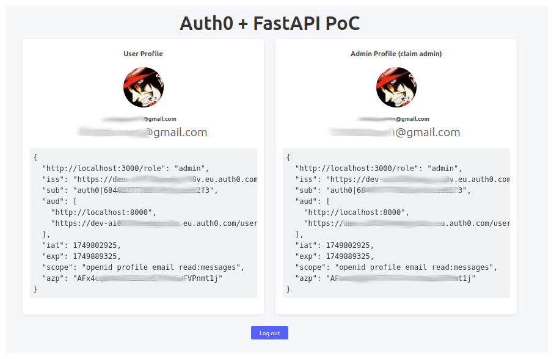

# React × FastAPI × Auth0 – Proof of Concept

A very small PoC that shows how to:

* authenticate a **React (Vite) Single-Page-Application** with Auth0  
* secure a **FastAPI** backend with the same tokens  
* enforce **role-based access** via a custom claim inside the `access_token`

---
## Demo 📸

| Admin view | Regular user view |
|------------|------------------|
|  |  |

*If the logged user has the custom claim `http://localhost:3000/role=admin`, the “Admin Profile” card is displayed and the request to `/api/private-scoped-admin` succeeds.  
Otherwise the card shows a friendly “Only admins can see this card.” message.*

---

## Flow

---

## Stack

| Layer      | Tech | Notes |
|------------|------|-------|
| **SPA**    | React 18 + Vite + TypeScript | Authentication handled by `@auth0/auth0-react`. |
| **Backend**| FastAPI + Uvicorn | JWT validation + fine-grained scope checks. |
| **Auth**   | Auth0 | Custom Action adds a namespaced `role` claim to the token. |

---

## How it works

1. **Login ↗ Auth0.**  
   The SPA requests `audience=http://localhost:8000` and the scopes `openid profile email read:messages`.  
2. **Auth0 Action** injects  
   ```json
   "http://localhost:3000/role": "admin"   // or "user" into every access- and ID-token.
3. FastAPI dependency VerifyToken validates the token (signatures, issuer, audience, scopes).

Endpoints can additionally check the custom role claim:

```python
if payload.get("http://localhost:3000/role") != "admin":
    raise HTTPException(403, "Access denied")

```
React calls the backend with fetch and the bearer token returned by
getAccessTokenSilently().

UI updates: if the call succeeds the JSON is rendered; if it fails (403) an error is shown.

## Quick start 🚀
### 1. Prerequisites
- Docker
- An Auth0 tenant (free tier is fine)

### 2. Clone & install
- git clone git@github.com:rrbarrero/auth0-toy.git
- cd fastapi-auth0-poc

### 3. Create two .env files
<details> <summary>frontend/.env</summary>
VITE_DOMAIN=dev-xxxxxxxx.eu.auth0.com
VITE_CLIENT_ID=YOUR_SPA_CLIENT_ID
VITE_AUDIENCE=http://localhost:8000
VITE_SCOPE=openid profile email read:messages
</details> <details> <summary>backend/.env</summary>
AUTH0_DOMAIN=dev-xxxxxxxx.eu.auth0.com
AUTH0_API_AUDIENCE=http://localhost:8000
AUTH0_ISSUER=https://dev-xxxxxxxx.eu.auth0.com
AUTH0_ALGORITHMS=RS256
APP_NAME_NAMESPACE=http://localhost:3000    # same namespace used in the Action
</details>

### 4. Run
- make start


Log in with a user that has role=admin in its App Metadata to see both cards.

Protected routes
Endpoint	Protection	Notes

- /api/private	token only	Any authenticated user.
- /api/private-scoped	token + scope read:messages	Demonstrates scope check.
- /api/private-scoped-admin	token + scope + **role admin    Full RBAC example**.

## Custom claim & Action

```js
// Auth0 ▸ Actions ▸ Post-Login
exports.onExecutePostLogin = async (event, api) => {
  const ns = 'http://localhost:3000/';
  const role = event.user.app_metadata?.role || 'user';

  api.accessToken.setCustomClaim(`${ns}role`, role);
  api.idToken.setCustomClaim(`${ns}role`, role);
};

```
Use a namespace you control to avoid collisions with standard claims.